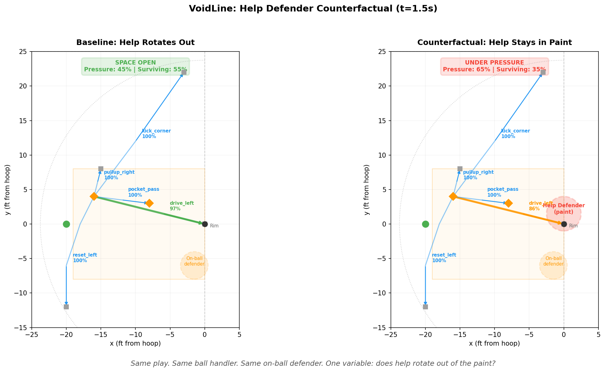
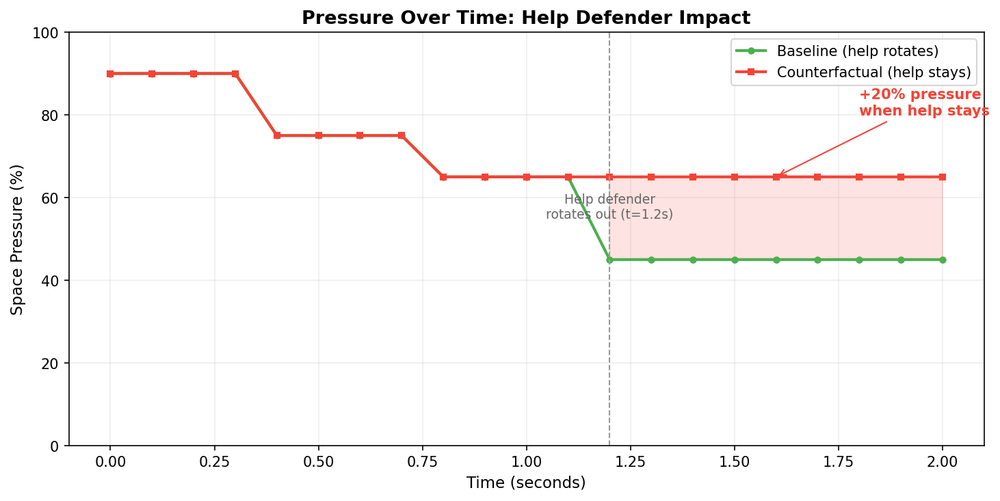

# VoidLine

**A constraint-driven engine that models what actions are impossible — not just what is possible.**

Sports game AI typically evaluates what an agent *should* do. VoidLine models what an agent *can no longer do*, and what removed it. The product is not a decision — it's the shape of surviving possibility after defensive pressure, kinematic commitment, perceptual limits, and rules have carved away the rest.

## Quick Start

```bash
git clone <repo-url>
cd VoidLine
pip install -r requirements.txt
python demo_runner.py
```

Expected output:

```
======================================================================
  VoidLine v0.3 — PNR Scenario Demo
======================================================================

  Active Constraints at t=0.0
  ---------------------------
    onball_defender_left_shade       source=opponent   vol= 25%  [sustained]
    help_defender_paint              source=opponent   vol= 20%  [transient]
    shot_clock_14s                   source=rules      vol=  5%  [decaying]
    rightward_momentum               source=self       vol= 15%  [transient]
    screen_not_yet_set               source=rules      vol= 10%  [transient]
    weak_side_blind_spot             source=perception vol=  8%  [sustained]
    contested_pullup                 source=risk       vol=  7%  [sustained]

    Space pressure: 90%
    Surviving volume: 10%

  Counterfactual: What If Help Defender Stays?
  --------------------------------------------
    First divergence: t=1.2s

    Time           Baseline   Help Stays      Delta
    --------------------------------------------
    t=1.2            45%          65% +      20% <-- diverges
    t=1.5            45%          65% +      20%

    drive_left at t=1.5s:
      Baseline (help rotates): 97%
      Replay (help stays):     86%
```

One defender's rotation changes pressure by 20 percentage points. The counterfactual replay proves it causally, not just descriptively.

---

**Anchor boundary:** This module is responsible ONLY for feasibility modeling (what actions are possible under constraints). It does NOT perform state extraction or execution timing — those belong to ISO4D and Decision Window respectively.

## The Core Problem

In gameplay AI, the difference between a good and bad decision often comes down to one defender rotating one step. But most systems don't model that rotation as a constraint that removes space — they model it as a position update and hope the decision logic catches up.

VoidLine makes the removal explicit:
- **What space was taken away?** (20% of possibility field)
- **By what?** (help defender in paint)
- **When did it change?** (defender rotated out at t=1.2s)
- **What would have happened if it hadn't?** (driving lane stays degraded)

## The Help Defender Flip

The strongest demonstration is a pick-and-roll scenario run twice. Same ball handler, same on-ball defender, same court geometry. One variable: does the help defender rotate out of the paint?



| Scenario | Pressure | drive_left | Status |
|---|---|---|---|
| Help rotates out (t=1.2s) | **45%** | **97%** viable | SPACE OPEN |
| Help stays in paint | **65%** | **86%** viable | UNDER PRESSURE |

One defender's rotation changes pressure by 20 percentage points and opens the primary driving lane. The counterfactual replay proves it — first divergence at exactly t=1.2s.



This is the exact scenario coaches describe: *"The help defender was late rotating — that's why the drive was open."* VoidLine captures that causally, not just descriptively.

## How It Works

Seven constraints are active at the start of a pick-and-roll:

```
onball_defender_left_shade    25%  [sustained]   opponent
help_defender_paint           20%  [transient]   opponent    <- expires at t=1.2s
rightward_momentum            15%  [transient]   self        <- expires at t=0.4s
screen_not_yet_set            10%  [transient]   rules       <- expires at t=0.8s
weak_side_blind_spot           8%  [sustained]   perception
contested_pullup               7%  [sustained]   risk
shot_clock_14s                 5%  [decaying]    rules
```

Each constraint removes a fraction of the action space. The possibility field is what survives. As constraints expire (momentum decays, screen arrives, help rotates), space reopens and corridors become viable.

The counterfactual system forks the timeline at any tick, applies a constraint change (remove, add, or replace), reruns the engine, and compares — showing exactly where and why the two timelines diverge.

## Constraint Categories

| Category | What it removes | Example |
|---|---|---|
| **Spatial** | Physical court regions | Defender denial area, blocked lane |
| **Temporal** | Time windows | Shot clock pressure, help defender arriving |
| **Kinematic** | Movement corridors | Overcommitted momentum, fatigue |
| **Role** | Actions invalid for current role | Not the ball handler, screener must hold |
| **Perceptual** | Actions requiring unseen information | Target behind vision cone |
| **Risk** | Actions exceeding risk thresholds | Contested shot above turnover limit |

## Two Validated Scenarios

| | PNR (Pick-and-Roll) | Transition (3-on-2) |
|---|---|---|
| Topology | Star (1 junction, 5 corridors) | Cascading (2 sequential junctions) |
| Pressure shape | Monotonic decrease (constraints expire) | Non-monotonic (drops then rises) |
| Key event | Help defender rotates out at t=1.2s | Recovering defender arrives at t=1.0s |
| Counterfactual | "What if help hadn't rotated?" | "What if recovering defender hadn't arrived?" |
| Result | +20% pressure, drive stays degraded | -20% pressure, wing kick stays viable |

The two scenarios prove the engine generalizes across topology shape, temporal profile, and constraint direction (expiry-driven vs activation-driven).

## Engine Integration Context

- Consumes game-state positions and constraint definitions (JSON-schema-validated)
- Runs a tick loop over the possession, recomputing the field and corridor viabilities each step
- Outputs per-tick pressure, corridor viability scores, and causal event attribution
- Counterfactual replay can be triggered at any decision point to evaluate alternatives

## What This Does Not Model (Yet)

- Geometric union of overlapping constraints (volumes are summed, not unioned)
- Continuously moving constraint boundaries (modeled as sequential transient windows)
- Multi-agent field interaction
- Agent decision-making over the surviving field

## Run

```bash
python -m pytest tests/ -v           # 122 tests
python demo_runner.py                # print PNR scenario table
python visualize_hero.py             # generate hero figures
python -m examples.help_defender_replay    # counterfactual replay report
python -m examples.transition_replay       # transition scenario replay
```

## Files

| Path | Purpose |
|---|---|
| `src/field/` | Spatial primitives, court model (ISO4D coordinates) |
| `src/constraints/` | Six constraint categories with temporal dynamics |
| `src/envelope/` | Possibility field computation, removal attribution |
| `src/engine/` | Tick loop, event detection |
| `src/rail/` | Topology loader, corridor viability projection |
| `src/replay/` | Counterfactual fork, timeline comparison, report generation |
| `scenarios/` | PNR and transition scenario definitions (JSON) |
| `adapter/` | Cross-anchor bridge: constraint generator + scheme engine |
| `adapter/scheme.py` | Defensive scheme engine (drop, ice, help_heavy) |
| `examples/` | Runnable replay scripts (help defender flip, transition) |
| `integration_iso3.py` | End-to-end integration (ISO4D -> scheme defense -> VoidLine) |
| `demo_runner.py` | Clean terminal demo of PNR scenario |
| `visualize_hero.py` | Two-panel court view + pressure timeline |

## Cross-Anchor Integration

VoidLine is the feasibility layer of a three-part gameplay AI decision stack:

```
ISO4D                     VoidLine                    Decision Window
video -> positions ->     schemes -> pressure ->      delays -> viability
(what is happening)       (what is allowed)           (what will still work)
```

**Defensive scheme determines baseline viability; animation delay determines when it dies.**

The full pipeline runs on a single extracted game state — ISO4D positions feed VoidLine scheme-driven defense, which feeds Decision Window timing evaluation:

```
Pass viability: PG -> SG at t=1.5s

              0ms      100ms     200ms     300ms
drop          OPEN     OPEN      DEAD      DEAD
ice           DEAD     DEAD      DEAD      DEAD
help_heavy    OPEN     DEAD      DEAD      DEAD
```

Ice kills the pass at any speed (deny-middle positioning). Drop allows it up to 200ms of animation delay. Help-heavy's tight gap help means even 100ms is fatal.

Run the full pipeline from the [Decision Window](../decision_window) repo:

```bash
cd ../decision_window
python integration_voidline.py
```
